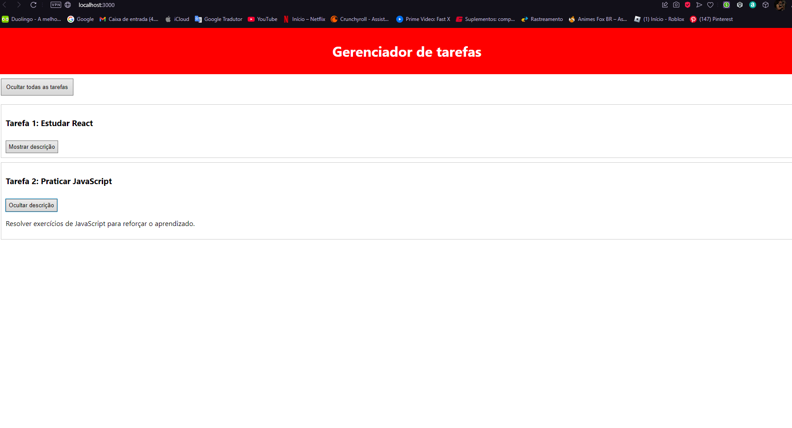

# Documentação da aula 016

## Informações Gerais
- **Data de Execução**: 04/12/2024
- **Aluno**: Lucas André

---

# Configuração do Projeto com React

## Passos Realizados

### Aula 16 - Criando um Gerenciador de Tarefas com React

## Descrição das Alterações

Nesta aula, eu realizei várias alterações no projeto para criar um gerenciador de tarefas utilizando React. As mudanças feitas foram:

- Criei o componente `Header`, que exibe o título "Task Manager".
- Criei o componente `TaskContainer`, que exibe uma lista de tarefas fictícias com títulos e descrições.
- Modifiquei o arquivo `App.js` para importar e renderizar os componentes `Header` e `TaskContainer`.
- Utilizei **CSS inline** para estilizar os componentes diretamente dentro de cada arquivo, garantindo um layout simples e funcional.

---

## Componente Header.js

 ***Descrição***: O componente `Header` é responsável por exibir o título "Task Manager" na parte superior da página. Ele serve como um cabeçalho fixo do aplicativo.

### O que o componente faz?
- O componente `Header` renderiza o título "Task Manager" e o exibe no topo da página. O título é centralizado e tem uma cor de fundo escura com texto branco, para dar um visual limpo e organizado.

### Como o estilo foi aplicado?
- O estilo foi aplicado diretamente no componente usando CSS inline. Um objeto JavaScript foi utilizado na propriedade `style`, onde defini o alinhamento do texto (`textAlign`), a cor de fundo (`backgroundColor`), e a cor do texto (`color`).

### Bloco de Código

```javascript
import React from 'react';

function Header() {
return (
    <header style={headerStyle}>
    <h1>Gerenciador de tarefas</h1>
    </header>
);
}

const headerStyle = {
backgroundColor: '#FF0000',
color: 'white',
textAlign: 'center',
padding: '10px',
};

export default Header;
```

## Componente TaskContainer.js

***Descrição***: O componente `TaskContainer` é responsável por exibir as tarefas. Ele recebe uma lista de tarefas fictícias e as exibe com seus respectivos títulos e descrições.

### O que o componente faz?

- O `TaskContainer` renderiza uma lista de tarefas, com o título e a descrição de cada uma. Cada tarefa é representada por uma `div`, e as informações das tarefas são armazenadas em um array de objetos chamado `tasks`.

### Como as tarefas são exibidas?

- As tarefas são exibidas dinamicamente usando o método `.map()`, que percorre o array de tarefas e renderiza cada tarefa em uma `div`. Cada item tem um título e uma descrição, que são inseridos nas tags `<h3>` e `<p>` respectivamente.

### Como o layout foi estilizado?

- A estilização foi feita com **CSS inline**, aplicando margens, bordas e espaçamento nas tarefas para deixá-las bem apresentadas. Cada tarefa tem um estilo próprio, com uma borda ao redor e um fundo branco.

# Bloco de Código
```javascript
import React from 'react';

function TaskContainer() {
  return (
    <div style={containerStyle}>
      <React.Fragment>
        <div style={taskStyle}>
          <h3>Tarefa 1: Planejar Viagem para Marte</h3>
          <p>Definir a lista de equipamentos necessários para a expedição ao planeta vermelho.</p>
        </div>
        <div style={taskStyle}>
          <h3>Tarefa 2: Preparar Cardápio Intergaláctico</h3>
          <p>Elaborar refeições compactas e nutritivas para os astronautas durante a viagem.</p>
        </div>
      </React.Fragment>
    </div>
  );
}

const containerStyle = {
  margin: '20px auto',
  padding: '10px',
  maxWidth: '600px',
  backgroundColor: '#f4f4f4',
  borderRadius: '8px',
};

const taskStyle = {
  backgroundColor: '#fff',
  padding: '10px',
  margin: '10px 0',
  border: '1px solid #ccc',
  borderRadius: '4px',
};

export default TaskContainer;

```

## Componente App.js
***Descrição***: O `App.js` é o ponto de entrada do aplicativo. Ele importa os componentes `Header` e `TaskContainer` e os renderiza na interface.

### O que o arquivo `App.js` faz?

- O arquivo `App.js` organiza a renderização dos componentes. Ele importa o componente `Header` e o componente `TaskContainer`, e os exibe dentro de uma `div`. O cabeçalho é exibido primeiro, seguido pela lista de tarefas.

### Como o componente `TaskContainer` é renderizado?

- O `TaskContainer` é renderizado diretamente no JSX do `App.js`. Ele não recebe dados como props, pois as tarefas estão definidas diretamente dentro do próprio componente.

# Bloco de Código
```javascript
import React from 'react';
import Header from './components/Header';
import TaskContainer from './components/TaskContainer';

function App() {
  return (
    <div>
      <Header />
      <TaskContainer />
    </div>
  );
}

export default App;
```

# Print do Site funcionando



# Estilização do Projeto
A estilização foi feita utilizando CSS inline, ou seja, os estilos foram aplicados diretamente dentro dos componentes React através da propriedade ``style``. Essa abordagem permite uma forma prática e rápida de aplicar estilos, sem a necessidade de arquivos CSS externos. Cada componente tem seus próprios estilos isolados, o que torna o código mais simples e fácil de entender. No entanto, enquanto o CSS inline é eficiente para projetos pequenos, para projetos maiores, pode ser necessário adotar outras estratégias, como o uso de arquivos CSS externos ou bibliotecas de estilização, para garantir melhor organização e escalabilidade do código.